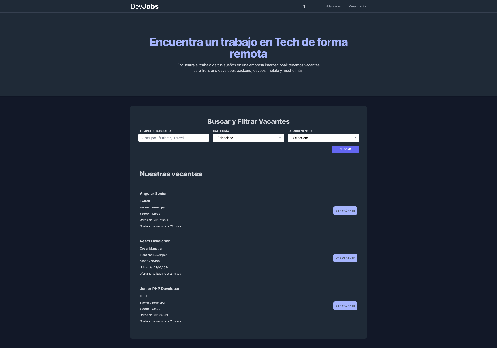
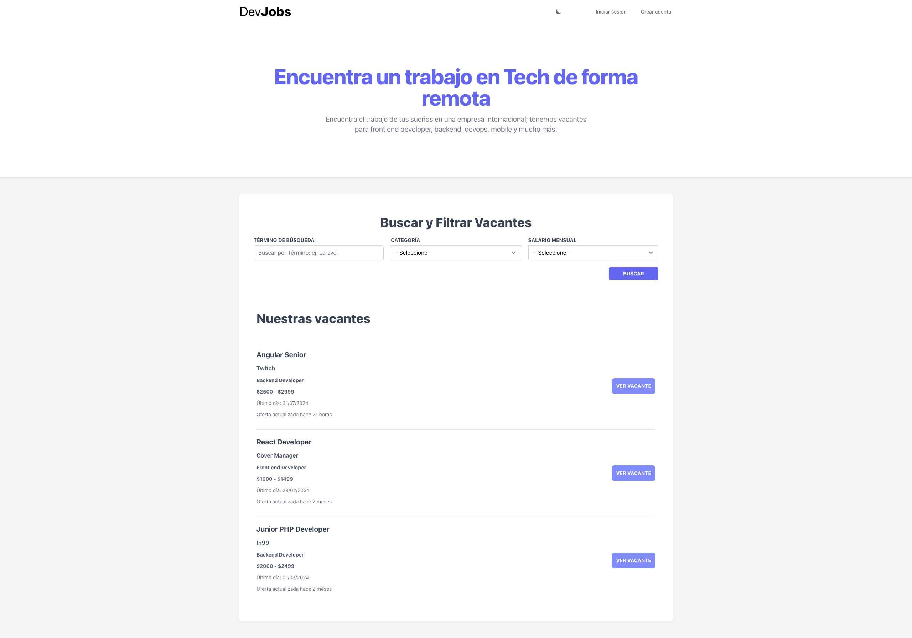

<p align="center"><a href="https://laravel.com" target="_blank"></a></p>

# DevJobs

Este es un proyecto ficticio realizado en el curso de Udemy de desarrollo web con Laravel [(Enlace)](https://www.udemy.com/course/curso-laravel-crea-aplicaciones-y-sitios-web-con-php-y-mvc/).

En este proyecto se ha utilizado:
- Laravel 10, aunque el curso este desarrollado con Laravel 9
- Livewire para las peticiones entre cliente y servidor
- Diseño creado con Tailwind CSS y utilizando blade como plantillas
- Implementación extra de modo claro y oscuro
- Gestión de usuarios con librería Breeze

## Despliegue

Para desplegar este proyecto en un entorno de Docker utilizando Sail, simplemente ejecuta el siguiente comando en la carpeta raíz de tu proyecto:

```bash
  sail up
```

Esto iniciará y configurará el entorno local de Docker con todas las dependencias necesarias para ejecutar tu aplicación Laravel.

Una vez que el entorno esté en funcionamiento, para manejar los cambios de diseño que se hagan con Tailwind CSS, ejecuta el siguiente comando en otra terminal dentro de la misma carpeta del proyecto:

```bash
  npm run dev
```

Este comando compilará los estilos CSS de Tailwind y lanzará un servidor de desarrollo local. Esto te permitirá visualizar los cambios en tiempo real mientras trabajas en el diseño de tu aplicación.

Asegúrate de ejecutar ambos comandos para tener tu entorno Docker funcionando y el servidor de desarrollo de Tailwind CSS activo para realizar modificaciones en tu proyecto Laravel de manera efectiva.

## Screenshots





</p>

## Autor

- [@raulfdeztdo](https://github.com/raulfdeztdo)
